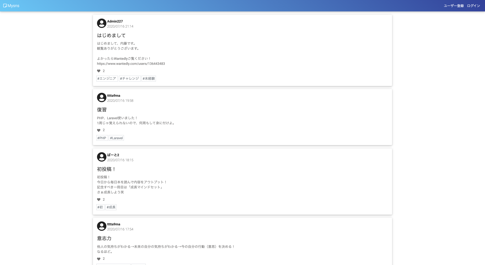
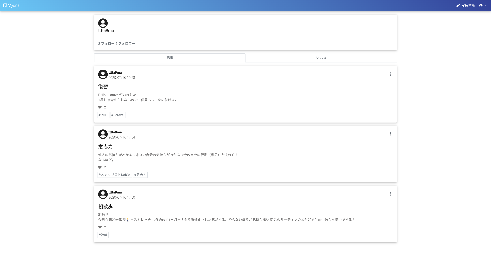
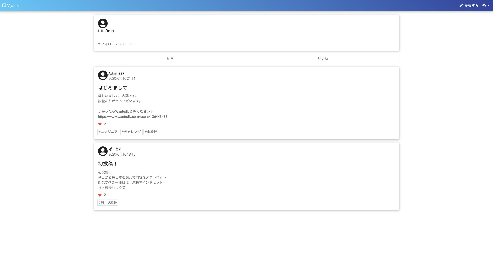

# アプリケーション名  
  
## [Mysns](http://my-snsx.herokuapp.com/)  
  
  
TOPページ  
  
  
  
  
  
ログインユーザーの記事一覧  
  
  
  
  
  
ログインユーザーのいいね一覧  
  
  
  
  
  
# このアプリで出来ること 
自分の成長を投稿し、記録するアプリです。 
  

# 概要
 ・データベース設計  
 ・ユーザー新規登録  
 ・ログイン/ログアウト機能  
 ・Googleアカウントを使ったユーザー登録・ログイン機能  
 ・メールを使ったパスワード再設定機能  
 ・ユーザーマイページ  
 ・メッセージ投稿  
 ・メッセージ一覧表示  
 ・メッセージ編集/削除  
 ・いいね機能  
 ・タグ機能  
 ・フォロー機能  
  
# 接続先情報
URL http://my-snsx.herokuapp.com/   
   
テストアカウント  
 ・メールアドレス: Admin227@gmail.com  
 ・パスワード: 2admin27  
  
# 開発環境  
 ・PHP  
 ・Laravel  
 ・Vue.js  
 ・SQL  
 ・Docker  
 ・Heroku  
 ・Github  
  

# DB設計
  

